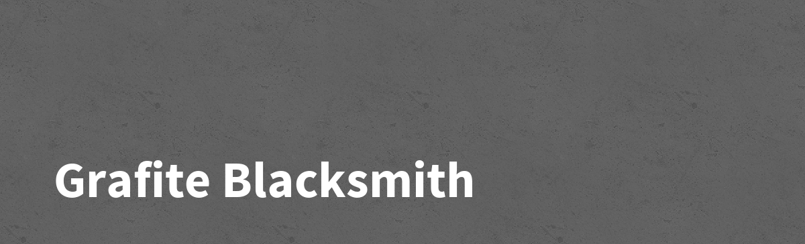

**Blacksmith** - An easy way to handle rebuilding a Forge based application.

[](https://github.com/GrafiteInc/Blacksmith/actions?query=workflow%3A%22PHP+Package+Tests%22)
[](https://codeclimate.com/github/GrafiteInc/Blacksmith/maintainability)
[](https://packagist.org/packages/grafite/blacksmith)
[](https://packagist.org/packages/grafite/blacksmith)

The Backsmith package is a easy to use tool for handling long term projects on Laravel Forge.

##### Author(s):
* [Matt Lantz](https://github.com/mlantz) ([@mattylantz](http://twitter.com/mattylantz), mattlantz at gmail dot com)

## Requirements

1. PHP 8.2+

## Compatibility and Support

| Laravel Version | Package Tag | Supported |
|-----------------|-------------|-----------|
| ^10.x | 1.x | yes |

### Installation

Start a new Laravel project:
```php
composer create-project laravel/laravel your-project-name
```

Then run the following to add Support
```php
composer require "grafite/blacksmith"
```

Time to publish those assets!
```php
php artisan vendor:publish --provider="Grafite\Blacksmith\BlacksmithProvider"
```

## Documentation

[https://docs.grafite.ca/utilities/blacksmith](https://docs.grafite.ca/utilities/blacksmith)

## License
Support is open-sourced software licensed under the [MIT license](http://opensource.org/licenses/MIT)

### Bug Reporting and Feature Requests
Please add as many details as possible regarding submission of issues and feature requests

### Disclaimer
THE SOFTWARE IS PROVIDED "AS IS", WITHOUT WARRANTY OF ANY KIND, EXPRESS OR IMPLIED, INCLUDING BUT NOT LIMITED TO THE WARRANTIES OF MERCHANTABILITY, FITNESS FOR A PARTICULAR PURPOSE AND NONINFRINGEMENT. IN NO EVENT SHALL THE AUTHORS OR COPYRIGHT HOLDERS BE LIABLE FOR ANY CLAIM, DAMAGES OR OTHER LIABILITY, WHETHER IN AN ACTION OF CONTRACT, TORT OR OTHERWISE, ARISING FROM, OUT OF OR IN CONNECTION WITH THE SOFTWARE OR THE USE OR OTHER DEALINGS IN THE SOFTWARE.
